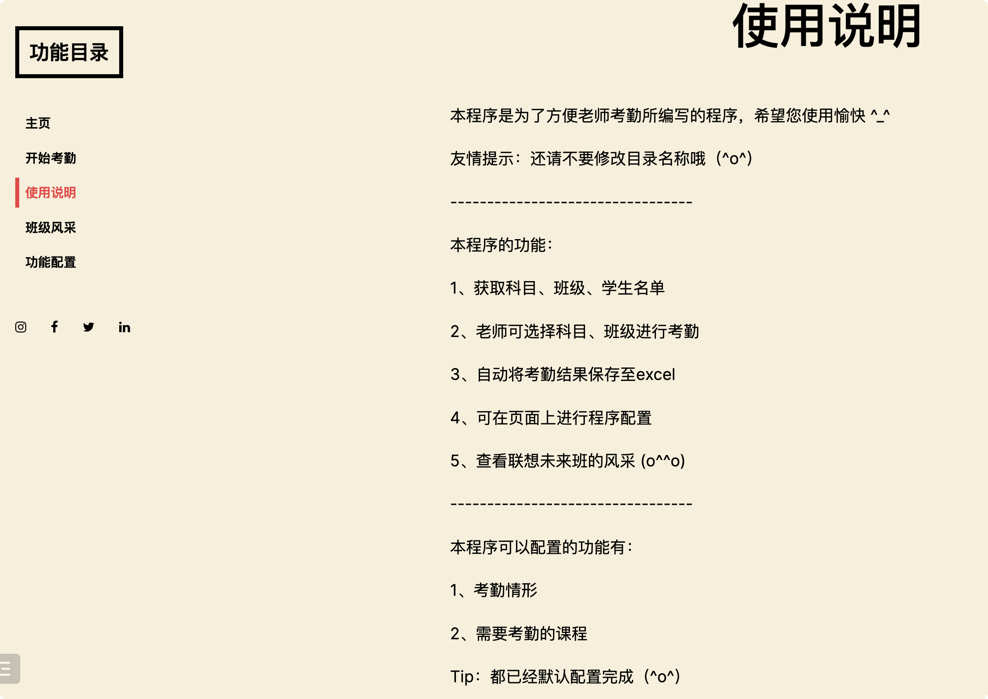

# 考勤程序v2.0

自从上次完成第一个版本的"考勤程序"后，同学们都感觉收获颇多，恰逢学校老师有"网页端"考勤程序的需求，遂称其所愿，开始开发考勤程序v2.0

项目历时1月有余，学生学习过程有稍许费力，但也最终顺利完成。

## 目录介绍：
```
交付版本v3-添加模版
│   __init__.py
│   Readme.md
│   requirements.txt
│   run.py： 程序入口  
│
└───0-说明文档和配置文档
│   说明文档.txt  【程序说明文档】
│   配置文档.txt  【程序配置文档】
│   
└───1-学生名单表
│   学生名单.xlsx 【学生的名单表】
│
└───2-考勤结果
│   考勤总表.xslx 【考勤结果汇总表】
│
└───考勤程序  【考勤程序源码】
│   └───static
│   │   │ ...
│   │    
│   └───templates
│   │   │...
│   │   
│   └───utils
│   │   │...
│   │...
```
### 点击[此处](https://www.mubucm.com/doc/7qqCUpkVh0r)可以查看思维导图
### 点击[此处](#todo)可以查看视频讲解


## 程序功能介绍

### 程序入口：`run.py`
程序运行起来后，使用浏览器输入http://127.0.0.1:5000/，进入程序主页。


### 点击左上角"开始考勤"目录，进入考勤页面

- 考勤页面选择"科目"、"第几节课"，"班级"，将会显示对应的学生名单。

- 考勤情形：考勤正常、请假、迟到、早退、旷课、做核酸、备赛、其他情况。

### 点击"使用说明"目录，进入使用说明页面


### 点击"班级风采"目录，进入班级风采页面
### 点击"功能配置"目录，进入功能配置页面
